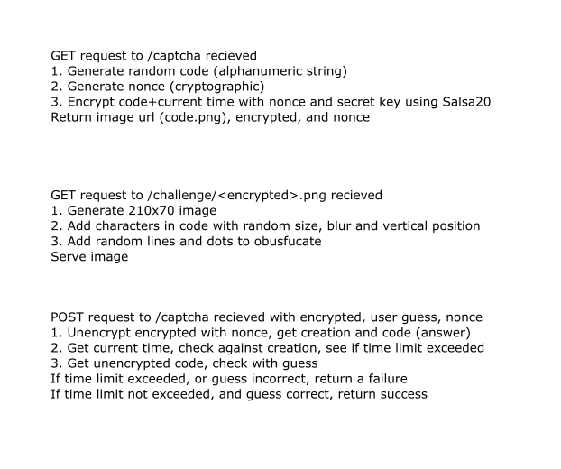

# Prussia Captcha: Stupidly Simple
Everything about this captcha is simple: the language (Ruby), lack of database, API, running, and the actual captcha (still hard enough to stop bots... hopefully).

## How it Works
It uses cryptography! And time! Probably no vulnerabilities. Create an issue if you find one.


## API
All requests should be made in the backend, obviously. Everything returned is JSON, except for the image.

### GET /captcha
Returns:

```
{
  "image": "the image url name",
  "code": "encrypted text",
  "nonce": "a cryptographic nonce needed to decode the code"
}
```

### GET /challenge/<image\>
Returns:

PNG Image (210x70) with the answer

### POST /captcha

Payload:

```
{
  "code": "the encrypted text",
  "guess": "user's nonce",
  "nonce": "the cryptographic nonce"
}
```

Returns:

```
{
  "success": bool (true or false)
}
```